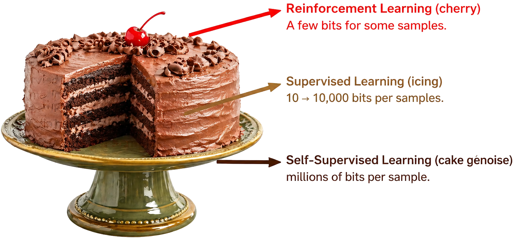

# Position: RL Should Be Used to Adjust Foundation Models, NOT Abused

This is the official project page repository for the paper:

> **Position: RL Should Be Used to Adjust Foundation Models, NOT Abused**
>
> Ting Huang\*, [Zeyu Zhang](https://steve-zeyu-zhang.github.io/)\*†, and Hao Tang‡
>
> \*Equal contribution. †Project lead. ‡Corresponding author.
>
> ### [Paper](https://openreview.net/pdf?id=Q83EEeC6ce) | [Website](https://aigeeksgroup.github.io/DontAbuseRL/)



## ✏️ Citation

If you find our paper or project page helpful, please consider citing:

```bibtex
@inproceedings{huang2026position,
  title={Position: RL Should Be Used to Adjust Foundation Models, NOT Abused},
  author={Huang, Ting and Zhang, Zeyu and Tang, Hao},
  booktitle={Proceedings of the 43rd International Conference on Machine Learning},
  year={2026}
}
```

---

## Intro

Reinforcement learning has become the shiny final step in foundation-model post-training. That status is deserved, but also dangerous. Our position is simple: RL should adjust foundation models after pretraining and cold-start supervision, not be abused as the default recipe for creating capabilities from scratch.

We view RL as a high-cost, high-leverage post-training operator. It is most reliable when it reallocates probability mass toward behaviors that a model can already express, improving correctness, consistency, constraint satisfaction, instruction following, tool-use discipline, and long-horizon stability.

This is not an impossibility claim. RL-first or self-supervised RL regimes may be useful when meaningful supervision or scaffolding is unavailable, verification is strong, and interaction is necessary for discovery. Under current foundation-model practice, however, such regimes should be treated as exceptions requiring stronger evidence and compute-accountable reporting.

## Five Pillars

1. **Use RL for adjustment.** RL should be used to adjust foundation models after pretraining, particularly when a model remains unsatisfactory in certain aspects.
2. **Use supervision or scaffolding first when available.** Meaningful supervised or scaffolded signals should usually precede RL.
3. **Do not over-credit RL for reasoning creation.** RL should not be assumed to create reasoning capability; in current foundation-model practice, it more often refines reasoning behaviors made elicitable by pretraining, SFT, or other scaffolds.
4. **Keep rewards auditable.** Reward design should prioritize auditability, verifiability, and minimal composition over opaque reward complexity.
5. **Treat SSRL as a boundary case.** Self-Supervised Reinforcement Learning is relevant for structured interaction settings, not as a generic replacement for pretraining or supervised scaffolding.

## News

- 2026/06/09: Project page repository initialized.
- 2026/06/09: Paper PDF linked via OpenReview.

## TODO List

- [x] Build the project page.
- [x] Add the paper link.
- [x] Add the cake analogy figure.
- [ ] Add arXiv link when available.
- [ ] Add BibTeX from the official proceedings page when available.

## Star History

[](https://www.star-history.com/?repos=AIGeeksGroup%2FDontAbuseRL&type=date&legend=top-left)


## Acknowledgement

We thank the foundation-model and reinforcement-learning communities for the discussions, systems, benchmarks, and critiques that motivated this position paper.
